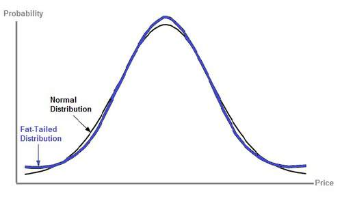

# Stock Alert - Detecting Anomalies in High Frequency Time Series Data

## Motivation
In 2018, 55 percent of adults in the United States invested in the stock market. There are thousands of companies in the market and all sorts idiosyncratic events takes place that can have dramatic impact on individual stock prices in a short period of time. This is a significant risk for stockholders and ideally they should be notified as soon as possible when such events occur such that they have the option to protect themselves by selling the stocks before the full impact is observed.

Consider this example below where this pharmaceutical company lost almost half of it's value within a day. An extreme event of this magnitude is likely to be composed of consecutive price changes that is unlike of what has been observed before. So to detect an anomalous event like this one should look for consecutive anomalous directional changes happening one after another. 

## Approach
My approach is to ingest real time stock prices for all the stocks in the NASDAQ exchange, transform them into stationary processes that have (roughly) normal distributions by first taking the log and differencing the time series. A  visual example of this transformation is shown below:

Prices and differences are stored into TimescaleDB. Once every day mean and standard deviation of these differences are calculated and stored into the distributions table. As new data is ingested and processed it is compared to the stored distributions. The property of the normal distribution dictates that 99.7% of the data falls within 3 standard deviations of the mean. If the incoming price changes are outside three standard deviations of the mean that difference is marked as anomalous and stored into the anomalies table.

Prices and anomalies detected are shown on the front-end using Flask and Highcharts. 

## Assumptions
One of the assumptions made here is that the transformed time series discussed above has a normal distribution. This assumption holds better for longer time periods but it is not necessarily true for shorter time frames. I've noticed the distributions to be more leptokurtic, in other words it has higher peaks and fatter tails. What this implies is that unlikely events are more likely to happen that is implied by the properties of the normal distribution. In other words 99.7% of data points does not fall into 3 standard deviations within the mean. 

This is easily observed by the number of anomalies detected by this system. These "more than 3 standard deviation" events happen all the time and it is marked on the price plots. 

This is not particularly a problem for this system as individual anomalous points are not important. An anomalous event is likely to be composed of multiple such changes happening within a short time frame. Three standard deviations threshold is basically used as the minimum sensitivity parameter. More specifically the system is looking for multiple anomalous changes happening in a short time frame and in the same direction. 

## Pipeline
Prices are ingested by Kafka, processed by Spark Streaming and stored into TimescaleDB.

## Front-end

On the homepage users are prompted for a date. This is the date for which the anomaly aggregations are done. Ideally this should be the previous day, meaning that all the anomalies starting from yesterday will be considered. This way the most recent anomalies are visible to the users. 

Based on the this date, the bubble plot is formed. The bubbles are colored with respect to the industry of the companies and the size of the bubbles indicate the number of anomalous points that have been detected since the date specified. The location of bubble indicates the directional intensity of the anomalous points. Ideally users would be interested in large bubbles that are either on the top right of the plot for significant positive changes and bottom left of the plot for significant negative changes. 

Bubbles are clickable which takes the user to the price time series of that particular stock, where each anomalous point is annotated by the intensity value. 

